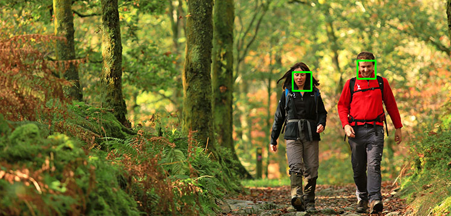
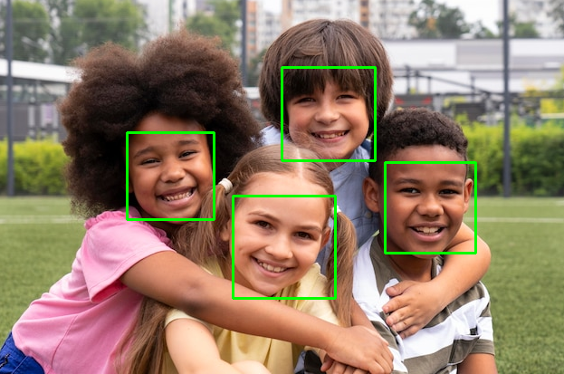

# Face Detection Web Service

## Setting Up
1. Clone the repository:
```
git clone https://github.com/Illia-tsar/face-detection-web-service.git
cd face-detection-web-service
```
2. Create and activate conda environment:
```
conda create --name <env_name> python=3.10
conda activate <env_name>
```
3. Install dependencies:
```
pip install -r requirements.txt
```
## Basic Usage
To begin with, run the server:
```
cd fd_api/
python manage.py runserver
```
Now, we are ready to use the command to interact with our face detection API via cURL:
```
curl -X POST 'http://localhost:8000/model/' -d 'url=<some-image-url>' ; echo ""
```
The response contains **status** and **detections** fields. The API returns the absolute coordinates of human faces.
## Test API
In order to visualize the predictions, the *test_api.py* script can be used. First you need to run the server, as explained in the previous section.
Next, you can run the *test_api.py* script with the following command:
```
python test_api.py
```
This will run detection on default image and display the results. You can alternatively specify url to some arbitrary image, like this:
```
python test_api.py --img_url <some-image-url>
```
**Example:**
```
python manage.py runserver
python test_api.py --img_url https://img.freepik.com/free-photo/medium-shot-smiley-kids-posing-together_23-2149073581.jpg
```
**Result:**


## Final Notes
In order to obtain bounding boxes for faces, *MediaPipe* was used under the hood, because of its lightweight and very accurate predictions when it comes to face detection. 
The **frame per second** of this model is 200-1000 depending on the specification of the devices.